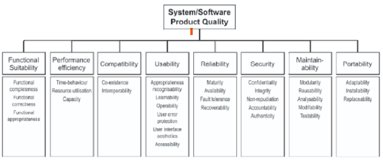

**Especificação inicial do modelo de qualidade**

  <figcaption>Figura 1: Modelo de Qualidade</figcaption>

### **Características da Qualidade**

A ISO 25010 faz parte da série SQUARE (System and Software Quality Requirements and Evaluation) e define modelos para avaliar a qualidade de produtos de software. O modelo apresenta 8 características de qualidade, sendo elas:

  - **Adequação Funcional:** grau em que um produto ou sistema fornece funções que atendem às necessidades declaradas e implícitas quando usado sob condições especificadas 
  - **Confiabilidade:** grau em que um produto ou sistema garante que os dados sejam acessíveis apenas àqueles autorizados a ter acesso.
  - **Segurança:** grau em que um produto ou sistema protege informações e dados para que pessoas ou outros produtos ou sistemas tenham o grau de acesso a dados apropriado aos seus tipos e níveis de autorização
  - **Manutenibilidade:** grau de eficácia e eficiência com que um produto ou sistema pode ser modificado pelos responsáveis ​​pela manutenção mantenedores
  - **Eficiência de Desempenho:** desempenho em relação à quantidade de recursos utilizados nas condições estabelecidas
  - **Compatibilidade:** grau em que um produto, sistema ou componente pode trocar informações com outros produtos, sistemas ou componentes e/ou executar suas funções necessárias, compartilhando o mesmo ambiente de hardware ou software
  - **Portabilidade:** grau de eficácia e eficiência com que um sistema, produto ou componente pode ser transferido de um hardware, software ou outro ambiente operacional ou de uso para outro
  - **Usabilidade:** grau em que um produto ou sistema pode ser usado por usuários específicos para atingir objetivos específicos com eficácia, eficiência e satisfação em um contexto de uso específico

 

### **Priorização das Qualidades**

***Método de Priorização***

A fim de priorizar as características a serem avaliadas, o grupo optou por utilizar o método Impacto, Risco e Esforço. O grupo debateu sobre o cada uma das características levantado diversas opiniões até que houvesse um consenso entre todo o grupo a respeito do número atribuído a cada um dos atributos (Impacto, Risco e Esforço). Antes da atribuição de valores, foi definido o que significa cada um dos critérios:

  - **Impacto:** Em uma escala de 1 a 5, o quanto a ausência da qualidade impacta no produto final, sendo 1 impacto pequeno e 5 impacto grande. 
  - **Risco:** Em uma escala de 1 a 5, a probabilidade de acontecerem problemas na qualidade, sendo 1 poucos problemas e 5 muitos problemas. 
  - **Esforço:** Em uma escala de 1 a 5, qual é o nível de esforço necessário para avaliar a qualidade, levando em consideração os recursos disponíveis para a avaliação (por exemplo, código e documentação), sendo 1 pouco esforço e 5 muito esforço.

Após a atribuição de valores para cada critério, foi calculado o peso final de cada característica, utilizando a fórmula a seguir:

  <strong>Peso final = (Impacto x Risco) / Esforço</strong>

 

***Aplicação do Método de Priorização***

Esses foram os valores atribuídos pelo grupo para cada uma das qualidades (com exceção da característica Usabilidade, por restrição da disciplina):

| Característica            | Impacto | Risco | Esforço | Peso Final | Prioridade |
|---------------------------|----------|--------|----------|-------------|-------------|
| **Confiabilidade**        | 5        | 4      | 3        | 6.6         | -           |
| Segurança                 | 3        | 2      | 2        | 3           | -           |
| **Manutenibilidade**      | 4        | 3      | 2        | 6           | -           |
| Eficiência de Desempenho  | 2        | 2      | 5        | 0.8         | —           |
| Adequação Funcional       | 5        | 2      | 2        | 5           | —           |
| Compatibilidade           | 3        | 3      | 2        | 4.5         | —           |
| Portabilidade             | 5        | 2      | 2        | 5           | —           |

  <figcaption>Tabela 1: Método de Priorização</figcaption>

***Justificativas das características priorizadas***

| Característica | Justificativa |
|----------------|----------------|
| Confiabilidade | A Confiabilidade obteve o maior Peso Final por julgarmos que, caso as turmas fornecidas pelo sistema não estejam de acordo com a oferta de matérias, o propósito do projeto não é atendido. |
| Manutenibilidade | A Manutenibilidade foi a segunda característica priorizada porque ela está diretamente relacionada à facilidade de manutenção, evolução e continuidade do projeto ao longo do tempo. |

  <figcaption>Tabela 2: Características Priorizadas</figcaption>

## Bibliografia

- ISO/IEC 25010:2011 — *Systems and software engineering — Systems and software Quality Requirements and Evaluation (SQuaRE) — System and software quality models*. ISO, 2011.

## Histórico de Versão

| Versão | Data       | Descrição                  | Autor(es) |
|:------:|:-----------|:---------------------------|:----------|
| 0.1    | 2026-05-11 | Criação inicial da página  | Caio Felipe |
| 1.0    | 2026-05-12 | Adição do conteúdo da página  | Anne de Capdeville |
