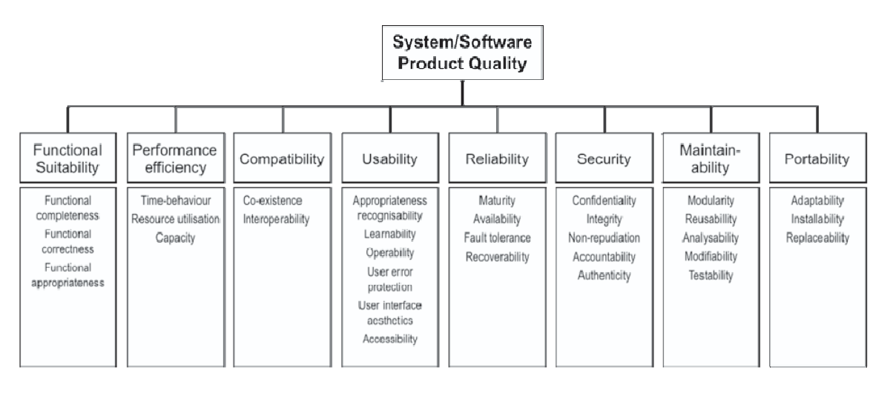

**Especificação inicial do modelo de qualidade**

  <figcaption>Figura 1: Modelo de Qualidade</figcaption>

### **Características da Qualidade**

A ISO 25010 faz parte da série SQUARE (System and Software Quality Requirements and Evaluation) e define modelos para avaliar a qualidade de produtos de software. O modelo apresenta 8 características de qualidade, sendo elas:

  - **Adequação Funcional:** grau em que um produto ou sistema fornece funções que atendem às necessidades declaradas e implícitas quando usado sob condições especificadas 
  - **Confiabilidade:** grau em que um produto ou sistema garante que os dados sejam acessíveis apenas àqueles autorizados a ter acesso.
  - **Segurança:** grau em que um produto ou sistema protege informações e dados para que pessoas ou outros produtos ou sistemas tenham o grau de acesso a dados apropriado aos seus tipos e níveis de autorização
  - **Manutenibilidade:** grau de eficácia e eficiência com que um produto ou sistema pode ser modificado pelos responsáveis ​​pela manutenção mantenedores
  - **Eficiência de Desempenho:** desempenho em relação à quantidade de recursos utilizados nas condições estabelecidas
  - **Compatibilidade:** grau em que um produto, sistema ou componente pode trocar informações com outros produtos, sistemas ou componentes e/ou executar suas funções necessárias, compartilhando o mesmo ambiente de hardware ou software
  - **Portabilidade:** grau de eficácia e eficiência com que um sistema, produto ou componente pode ser transferido de um hardware, software ou outro ambiente operacional ou de uso para outro
  - **Usabilidade:** grau em que um produto ou sistema pode ser usado por usuários específicos para atingir objetivos específicos com eficácia, eficiência e satisfação em um contexto de uso específico

 

### **Priorização das Qualidades**

#### ***Método de Priorização***

A fim de priorizar as características a serem avaliadas, o grupo optou por utilizar o método Impacto, Risco e Esforço. O grupo debateu sobre o cada uma das características levantado diversas opiniões até que houvesse um consenso entre todo o grupo a respeito do número atribuído a cada um dos atributos (Impacto, Risco e Esforço). Antes da atribuição de valores, foi definido o que significa cada um dos critérios:

  - **Impacto:** Em uma escala de 1 a 5, o quanto a ausência da qualidade impacta no produto final, sendo 1 impacto pequeno e 5 impacto grande. 
  - **Risco:** Em uma escala de 1 a 5, a probabilidade de acontecerem problemas na qualidade, sendo 1 poucos problemas e 5 muitos problemas. 
  - **Esforço:** Em uma escala de 1 a 5, qual é o nível de esforço necessário para avaliar a qualidade, levando em consideração os recursos disponíveis para a avaliação (por exemplo, código e documentação), sendo 1 pouco esforço e 5 muito esforço.

Após a atribuição de valores para cada critério, foi calculado o peso final de cada característica, utilizando a fórmula a seguir:

  <strong>Peso final = (Impacto x Risco) / Esforço</strong>

 

#### ***Aplicação do Método de Priorização***

Esses foram os valores atribuídos pelo grupo para cada uma das qualidades (com exceção da característica Usabilidade, por restrição da disciplina):

| Característica            | Impacto | Risco | Esforço | Peso Final | Prioridade |
|---------------------------|----------|--------|----------|-------------|-------------|
| **Confiabilidade**        | 5        | 4      | 3        | 6.6         | 1           |
| **Manutenibilidade**      | 4        | 3      | 2        | 6           | 2           |
| Adequação Funcional       | 5        | 2      | 2        | 5           | —           |
| Portabilidade             | 5        | 2      | 2        | 5           | —           |
| Compatibilidade           | 3        | 3      | 2        | 4.5         | —           |
| Segurança                 | 3        | 2      | 2        | 3           | —           |
| Eficiência de Desempenho  | 2        | 2      | 5        | 0.8         | —           |

  <figcaption>Tabela 1: Método de Priorização</figcaption>

#### ***Justificativas das características priorizadas***

| **Característica** | **Justificativa** |
|----------------|----------------|
| Confiabilidade | A Confiabilidade obteve o maior peso final (Peso 6,6) por julgarmos que caso as turmas fornecidas por ele não estejam de acordo com a oferta de matérias, resultando em um output equivocado para os usuários, o principal propósito do projeto de servir de apoio à comunidade de estudantes da UnB no processo de estruturar suas grades horárias não sería atendido, podendo gerar potenciais prejuízos aos usuários.  **Stakeholders:** Comunidade de estudantes da Universidade de Brasília (UnB). |
| Manutenibilidade | A Manutenibilidade (Peso 6,0) é elementar para prolongar a vida útil desse projeto que é open source e de código legado. Uma vez que a arquitetura do projeto está diretamente ligada a sistemas de terceiros (como a fonte de dados extraídas por web scraping do SIGAA), bem como o uso do Heroku para implantação, que necessita de atualizações de status de assinatura constantes, faz-se necessário que o Sua Grade UnB possua uma base de código de fácil manutenção e entendimento, facilitando o processo de manutenção de código e, concomitantemente, fomentando a colaboração da comunidade.  **Stakeholders:** Facilita o trabalho da Comunidade OSS (contribuições e correções) e dos principais autores do projeto. |

  <figcaption>Tabela 2: Características Priorizadas</figcaption>

#### ***Justificativas das características não priorizadas***

| **Característica** | **Justificativa** |
|----------------|----------------|
| Segurança | A característica Segurança obteve um peso final menor (3,0) em comparação às características priorizadas devido à combinação entre impacto e risco moderados e baixo esforço de avaliação. Apesar de importante, o grupo considerou que o sistema não realiza armazenamento extensivo de dados sensíveis dos usuários, reduzindo parcialmente os riscos associados à proteção de dados. Dessa forma, concluiu-se que, dentro do contexto e dos recursos disponíveis para este trabalho, outras características apresentavam maior prioridade de avaliação.  |
| Eficiência de desempenho | A Eficiência de Desempenho apresentou o menor peso final (0,8). O grupo analisou que o “SuaGradeUnB” não é um sistema que exige alta velocidade de processamento ou respostas imediatas para que seu objetivo principal seja atendido adequadamente. Como o propósito do sistema está relacionado principalmente à organização de grades e consultas de informações acadêmicas, eventuais limitações de desempenho tendem a possuir impacto reduzido comparado com as demais características. |
| Adequação funcional | Embora a Adequação Funcional tenha recebido um impacto elevado, seu peso final (5,0) foi o mesmo de Portabilidade, estando assim os dois empatados no nível de priorização. Considerou-se que o “SuaGradeUnB” já possui funcionalidades consolidadas e amplamente utilizadas pela comunidade acadêmica, atendendo adequadamente às principais necessidades relacionadas ao planejamento de grades horárias.  |
| Compatibilidade | A Compatibilidade obteve peso final intermediário (4,5), porém não suficiente para ser priorizada. O grupo avaliou que o sistema utiliza tecnologias web amplamente consolidadas e acessadas por navegadores modernos, reduzindo os riscos relacionados à interoperabilidade e execução em diferentes ambientes de software. Além disso, não foram identificados indícios significativos de incompatibilidades que impactam diretamente a utilização do sistema pelos usuários. |
| Portabilidade | Assim como Adequação funcional, a Portabilidade apresentou peso final (5,0). O “SuaGradeUnB” é uma aplicação web desenvolvida com abordagem Mobile First, apresentando compatibilidade com diferentes tamanhos de tela e dispositivos, o que reduz significativamente possíveis problemas relacionados ao acesso e utilização do sistema pelos usuários. Por se tratar de uma aplicação acessada diretamente pelo navegador, faz com que questões relacionadas à portabilidade estejam mais relacionadas à experiência de acesso do usuário do que à necessidade de adaptação do sistema para diferentes ambientes operacionais. O grupo considerou que outras características apresentavam maior prioridade. |

  <figcaption>Tabela 3: Características Não Priorizadas</figcaption>

### ***Visão Geral do Modelo***

***Especificação do Modelo***

As características de qualidade de software escolhidas para plano foram a **Confiabilidade** e **Manutenibilidade**. Essas dimensões, como demonstrado abaixo, foram selecionadas por representarem aspectos críticos para o funcionamento contínuo, confiabilidade dos outputs gerados para os usuários e a evolução da aplicação a partir de uma base de código open source.

***Dimensões Avaliadas***

**Confiabilidade**: Assegurar a exatidão dos outputs gerados pelas funções do sistema para os usuários finais.
 
**Manutenibilidade**: Assegurar a qualidade da base de código visando futuras operações de manutenção, contribuição e evolução.

## Bibliografia

- ISO/IEC 25010:2011 — *Systems and software engineering — Systems and software Quality Requirements and Evaluation (SQuaRE) — System and software quality models*. ISO, 2011.

## Histórico de Versão

| Versão | Data       | Descrição                  | Autor(es) |
|:------:|:-----------|:---------------------------|:----------|
| 0.1    | 2026-05-11 | Criação inicial da página  | Caio Felipe |
| 1.0    | 2026-05-12 | Adição do conteúdo da página  | Anne de Capdeville |
| 1.1    | 2026-05-13 | Ajustes nos textos sobre Justificativas das características priorizadas  | Marllon Cardoso |
| 1.2    | 2026-05-12 | Novas alterações e documentação  | Anne de Capdeville |
