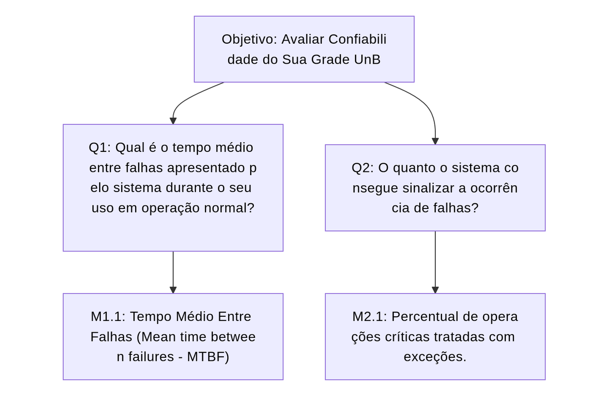

## Objetivo de Medição 1: Confiabilidade

  <table border="1" cellspacing="0" cellpadding="8" style="border-collapse: collapse; text-align: left;">
    <tr>
      <th><b>Analisar</b></th>
      <td>Sua Grade UnB</td>
    </tr>
    <tr>
      <th><b>Para o propósito de</b></th>
      <td>Avaliar</td>
    </tr>
    <tr>
      <th><b>Com respeito a</b></th>
      <td>Confiabilidade</td>
    </tr>
    <tr>
      <th><b>Do ponto de vista da</b></th>
      <td>Equipe do projeto</td>
    </tr>
    <tr>
      <th><b>No contexto da</b></th>
      <td>Disciplina de Qualidade de Software 1 (FCTE - UnB)</td>
    </tr>
  </table>

  <figcaption>Tabela 1: Objetivo de Medição: Confiabilidade</figcaption>

---

### Perguntas e Hipóteses de Medição

Para alcançar o objetivo de medição para a característica de Confiabilidade, abaixo foram elaboradas questões com suas respectivas hipóteses (as quais estabelecem metas que ilustram a qualidade atual do sistema a partir das métricas que serão estabelecidas posteriormente neste fragmento).

> Confiabilidade: Grau em que um sistema, produto ou componente executa as funções especificadas sob condições especificadas por um período de tempo especificado

**Questão 1: Maturidade** (Grau em que um sistema, produto ou componente atende às necessidades de confiabilidade sob operação normal)
> Qual é o tempo médio entre falhas apresentado pelo sistema durante o seu uso em operação normal?

* **Hipótese 1.1 (H1.1):** O sistema apresentará um Tempo Médio Entre Falhas (MTBF) superior a 10 minutos ou nenhuma falha encontrada.

**Questão 2: Tolerância a falhas** (Grau em que um sistema, produto ou componente opera conforme o pretendido, apesar da presença de falhas de hardware ou software)
> O quanto o sistema consegue sinalizar a ocorrência de falhas?

* **Hipótese 2.1 (H2.1):** 90% ou mais das operações críticas, como conexões com banco de dados, manipulação de arquivos e autenticação e autorização de usuários, possuirão um mecanismo adequado de tratamento de exceções (try-catch).

---

### Seleção das Métricas

**Questão 1: Maturidade**

* **Métrica 1.1: Tempo Médio Entre Falhas (Mean time between failures - MTBF)**
    * **Definição:** Tempo decorrido de sessão de uso controlado do sistemas dividido pelo número de falhas detectadas durante essa sessão de uso. Neste contexto, a "falhas" referen-se à eventos que impessam ou atrapalhem o uso do sistema por parte do usuário, como falhas de autenticação, falhas de carregamento das páginas, problemas para exportar os arquivos gerados e outras falhas da mesma natureza.  
    * **Fórmula:** `(Tempo da sessão de uso em minutos) / (quantidade de falhas identificadas)`
    * **Coleta:** 
        1. Iniciar uma sessão de uso com usuários finais;
        2. Incrementar 1 em um contador iniciado em 0 a cada falha encontrado pelos usuários;
        3. Ao final da sessão, coletar o tempo decorrido da mesma em minutos;
        4.  Aplicar a fórmula apontada acima.

    * **Pontuação de Julgamento:** 

    | **Excelente** | **Bom** | **Regular** | **Insatisfatório** |
    |:--------------:|:--------:|:-------------:|:-------------------:|
    | MTBF > 10 minutos ou nenhuma falha detectada | MTBF entre 4 e 10 minutos | MTBF entre 1 e 4 minutos | MTBF < 1 hora |

    * **Propósito:** Avaliar o nível de estabilidade alcançado pelo produto sob a perspectiva dos usuários finais.

**Questão 2: Tolerância a falhas**

* **Métrica 2.1: Percentual de operações críticas tratadas com exceções.**
    * **Definição:** Percentual de operações críticas que estão contidas dentro de um bloco de exceções (`try-catch`) para os módulos de Backend e Frontend (conforme detalhados na Fase 1 - Contexto da Avaliação).
    * **Fórmula:** `(Número de operações críticas com try-catch / Número total de operações críticas) * 100`
    * **Coleta:** 
        1. Definir a lista de "operações críticas": chamadas de função/método para conexão com banco de dados, manipulação de arquivos, manipulação de dados do web scraping, autenticação e autorização.
        2. Em **todo o código-fonte do projeto**, contar o número total de ocorrências dessas operações.
        3. Contar quantas dessas ocorrências estão sintaticamente dentro de um bloco `try { ... }`.
        4. Aplicar a fórmula acima.
        
    * **Pontuação de Julgamento:** 

    | **Excelente** | **Bom** | **Regular** | **Insatisfatório** |
    |:--------------:|:--------:|:-------------:|:-------------------:|
    | ≥ 90% | 70%–89% | 40%–69% | < 40% |

    * **Propósito:** Medir a robustez do código contra erros em tempo de execução.

### Critérios para Julgamento

* **Aceitável:** ≥ 70% das métricas classificadas como "Bom" ou "Excelente". O sistema demonstra robustez e previsibilidade.
* **Parcialmente aceitável:** Entre 40% e 69% das métricas com nível "Regular" ou superior. O sistema funciona, mas pode apresentar instabilidades pontuais.
* **Inaceitável:** > 30% das métricas atingindo o nível "Insatisfatório". A estabilidade do sistema é considerada crítica e propensa a falhas.

---

### Relação entre a Confiabilidade, Perguntas e Métricas

  <table border="1" cellspacing="0" cellpadding="8" style="border-collapse: collapse; text-align: left;">
    <tr>
      <th><b>Questão</b></th>
      <th><b>Métricas Simplificadas</b></th>
      <th><b>Tipo de Coleta</b></th>
    </tr>
    <tr>
      <td><b>Maturidade</b> Qual é o tempo médio entre falhas apresentado pelo sistema durante o seu uso em operação normal?</td>
      <td>
        M1.1: Métrica 1.1: Tempo Médio Entre Falhas (Mean time between failures - MTBF)
      </td>
      <td>
        Tempo decorrido de sessão de uso controlado do sistemas dividido pelo número de falhas detectadas durante essa sessão de uso.
      </td>
    </tr>
      <tr>
      <td><b>Tolerância a falhas</b> O quanto o sistema consegue sinalizar a ocorrência de falhas?</td>
      <td>
        M2.1: Métrica 2.1: Percentual de operações críticas tratadas com exceções.
      </td>
      <td>
        Percentual de operações críticas que estão contidas dentro de um bloco de exceções (`try-catch`).
      </td>
    </tr>
  </table>

  

    <figcaption>Tabela 2: Questões e Métricas Simplificadas</figcaption>
  

---

### Diagrama GQM - Confiabilidade (Representação Estrutural)

  <figcaption>Figura 2: Confiabilidade (Representação Estrutural)</figcaption>

## Histórico de Versão

| Versão | Data       | Descrição                  | Autor(es) |
|:------:|:-----------|:---------------------------|:----------|
| `1.0`  | 11/06/2026 | Adição do documento de conclusão da Fase 2 e da tabela de histórico de versão.                                              | [Marllon Cardoso](https://github.com/m4rllon)             |
| `1.1`    | 2026-06-23 | Alteração no diagrama de relação entre confiabilidade, Perguntas e Métricas | [Marllon Cardoso](https://github.com/m4rllon)     |

