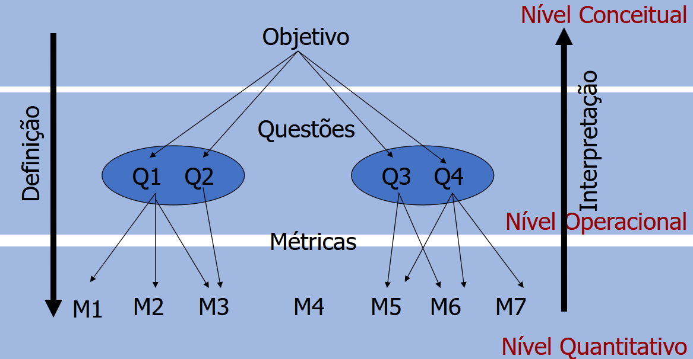

# Introdução

Após a realização da [Fase 1](../fase1/conclusao.md) do Processo de Avaliação de Produto, o próximo passo seria a Especificação da Avaliação, realizando a seleção de métricas, o estabelecimento de níveis de pontuação para as métricas e de critérios de julgamentos para as métricas.

Para o estabelecimento de métricas foi utilizada a abordagem Goal Question Metric (GQM) com o foco nas características priorizadas no [modelo de qualidade](../fase1/qualidades.md), sendo elas:

- **Confiabilidade:** grau em que um produto ou sistema garante que os dados sejam acessíveis apenas àqueles autorizados a ter acesso.
- **Manutenibilidade**: grau de eficácia e eficiência com que um produto ou sistema pode ser modificado pelos responsáveis ​​pela manutenção.

## Abordagem GQM

A metodologia GQM, desenvolvida por Victor Basili em 1994, foca na criação de métricas orientadas a um objetivo. Seguindo essa premissa, a metodologia possui três níveis, sendo eles: Conceitual, Operacional e Quantitativo.

  <figcaption>Figura 2.1: Estrutura do GQM</figcaption>

1. O GQM se inicia com a definição de um objetivo, ou seja, para qual motivo será realizada a medição.
2. Posteriomente há a definição de questões que deverão ser respondidas a partir das métricas. Juntamente disso, são definidas hipóteses, que são as respostas esperadas.
3. Por fim, as métricas são definidas com base nas questões criadas.

## Histórico de Versão

| Versão | Data       | Descrição                  | Autor(es) |
|:------:|:-----------|:---------------------------|:----------|
| 0.1    | 2026-06-09 | Criação inicial da página  | Ana Clara Borges     |