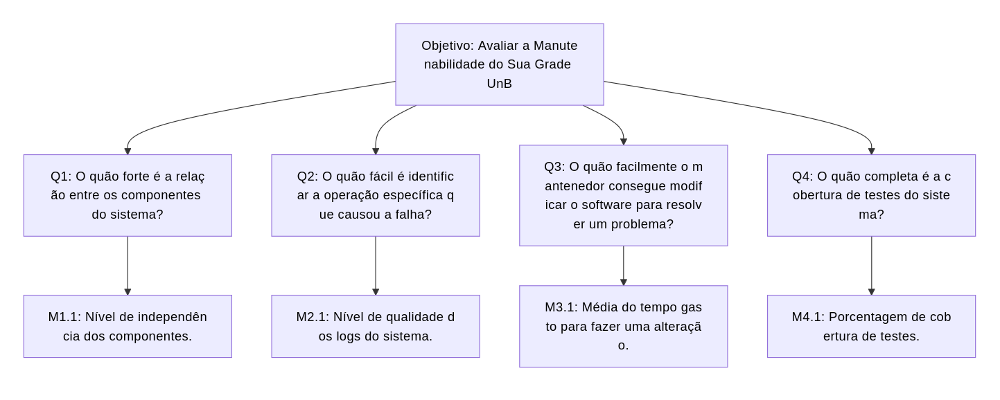

# Medição 2 - Manutenibilidade

## Objetivo de Medição 2 - Manutenibilidade

  <table border="1" cellspacing="0" cellpadding="8" style="border-collapse: collapse; text-align: left;">
    <tr>
      <th><b>Analisar</b></th>
      <td>Sua Grade UnB</td>
    </tr>
    <tr>
      <th><b>Para o propósito de</b></th>
      <td>Avaliar</td>
    </tr>
    <tr>
      <th><b>Com respeito a</b></th>
      <td>Manutenibilidade</td>
    </tr>
    <tr>
      <th><b>Do ponto de vista da</b></th>
      <td>Equipe do projeto</td>
    </tr>
    <tr>
      <th><b>No contexto da</b></th>
      <td>Disciplina de Qualidade de Software 1 (FCTE - UnB)</td>
    </tr>
  </table>

  <figcaption>Tabela 2.3: Objetivo de Medição: Manutenibilidade</figcaption>

---

### Perguntas e Hipóteses de Medição

Para alcançar o objetivo de medição para a característica de Manutenibilidade, abaixo foram elaboradas questões com suas respectivas hipóteses (as quais estabelecem metas que ilustram a qualidade atual do sistema a partir das métricas que serão estabelecidas posteriormente neste fragmento).

> Manutenibilidade: grau de eficácia e eficiência na qual um sistema consegue ser modificado pelos mantenedores responsáveis.

**Questão 1: Modularidade** (Grau em que um sistema ou programa é composto por componentes discretos, de tal forma que a mudança em um tenha um impacto mínimo em outros componentes)
> O quão forte é a relação entre os componentes do sistema?

* **Hipótese 1.1 (H1.1):** O nível de independência dos componentes do sistema é igual ou superior a 80%.

**Questão 2: Analisabilidade** (Grau de eficácia e eficiência com que é possível avaliar o impacto em um produto ou sistema de uma mudança pretendida em uma ou mais de suas partes, ou diagnosticar deficiências ou causas de falhas em um produto, ou identificar partes a serem modificadas.)
> O quão fácil é identificar a operação específica que causou a falha?

* **Hipótese 2.1 (H2.1):** A qualidade dos logs do sitema é igual ou supeiror a 90%, sendo possível identificar as operações que causaram a falha.

**Questão 3: Modificabilidade** (Grau em que um produto ou sistema pode ser modificado de forma eficaz e eficiente, sem introduzir defeitos ou degradar a qualidade do produto existente.)
> O quão facilmente o mantenedor consegue modificar o software para resolver um problema?

* **Hipótese 3.1 (H4.1):** O tempo gasto para o mantenedor fazer uma alteração é menor ou igual a 5 horas.

**Questão 4: Testabilidade** (Grau de eficácia e eficiência com que os critérios de teste podem ser estabelecidos para um sistema, produto ou componente, e os testes podem ser realizados para determinar se esses critérios foram atendidos.)
> O quão completa é a cobertura de testes do sistema?

* **Hipótese 4.1 (H4.1):** A porcentagem de cobertura de testes é igual ou maior a 90%.

---

### Seleção das Métricas

**Questão 1: Modularidade**

* **Métrica 1.1: Nível de independência dos componentes**
    * **Definição:** Quantidade de componentes que não dependem de outros dividido pela quantidade de componentes do sistema. Essa avaliação será feita para os módulos de Backend e Frontend (conforme detalhados na Fase 1 - Contexto da Avaliação)
    * **Fórmula:** `(quantidade de componentes do sistema independentes) / (quantidade de componentes do sistema)`
    * **Coleta:** 
        1. Calcular as classes ou módulos do sistema;
        2. Identificar as dependências delas;
        3. Aplicar a fórmula apontada acima.

    * **Pontuação de Julgamento:** 

    | **Excelente** | **Bom** | **Regular** | **Insatisfatório** |
    |:--------------:|:--------:|:-------------:|:-------------------:|
    | 80% de independência | 60% de independência | 50% de independência | >50% de independência|

    * **Propósito:** Avaliar o nível de independência entre as classes do sistema.

**Questão 2: Analisabilidade**

* **Métrica 2.1: Nível de qualidade dos logs do sistema**
    * **Definição:** Quantidade de eventos, logs ou passos que o sistema efetivamente grava em produção enquanto roda dividido pela quantidade de dados planejados para serem registrados que seriam suficientes para monitorar o status do sistema/software durante a operação. Essa avaliação será feita para os módulos de Backend, Web Scraping e Frontend (conforme detalhados na Fase 1 - Contexto da Avaliação)
    * **Fórmula:** `(quantidade de dados realmente registrados durante a operação) / (quantidade de dados planejados para serem registrados que seriam suficientes para monitorar o status do sistema/software durante a operação)`
    * **Coleta:** 
        1. Mapeamento de operações críticas;
        2. Descoberta de quantos dados cada operação crítica registra;
        3. Uso de ferramentas de centralização de logs para verificação dos dados retornados; Ou verificação de quantos métodos de operações críticas possuem a chamada de funções de log.
        4. Aplicar a fórmula apontada acima.

    * **Pontuação de Julgamento:** 

    | **Excelente** | **Bom** | **Regular** | **Insatisfatório** |
    |:--------------:|:--------:|:-------------:|:-------------------:|
    | 90% de qualidade| 70% de qualidade | 50% de qualidade | >50% de qualidade|

    * **Propósito:** Avaliar se o sistema gera informações suficientes para que, quando ocorra uma falha, seja possível descobrir exatamente qual operação a causou.

**Questão 3: Modificabilidade**

* **Métrica 3.1: Média do tempo gasto para fazer uma alteração**
    * **Definição:** Soma do tempo gasto para fazer alterações dividido pela quantidade de alterações.
    * **Fórmula:** `(soma do tempo gasto para fazer alterações) / (quantidade de alterações realizadas)`
    * **Coleta:** 
        1. Escolha de um período para a coleta de dados;
        2. Coleta do tempo entre uma issue passar de Em Andamento para Concluída;
        3. Uso de ferramentas de centralização de logs para verificação dos dados retornados; Ou verificação de quantos métodos de operações críticas possuem a chamada de funções de log;
        4. Aplicar a fórmula apontada acima.

    * **Pontuação de Julgamento:** 

    | **Excelente** | **Bom** | **Regular** | **Insatisfatório** |
    |:--------------:|:--------:|:-------------:|:-------------------:|
    | 5 horas por alteração | 8 horas por alteração | 10 horas por alteração | >10 horas por alteração|

    * **Propósito:** Avaliar o quão fácil é para o mantenedor fazer alterações no sistema.

**Questão 4: Testabilidade**

* **Métrica 4.1: Porcentagem de cobertura de testes**
    * **Definição:** Quantidade de testes automatizados escritos dividida pela quantidade de cenários de teste que deveriam ter sido escritos. Essa avaliação será feita para os módulos de Backend, Web Scraping e Frontend (conforme detalhados na Fase 1 - Contexto da Avaliação)
    * **Fórmula:** `(quantidade de testes automatizados escritos) / (quantidade de cenários de teste que deveriam ter sido escritos)`
    * **Coleta:** 
        1. Rodar a suíte de testes para descobrir quantos casos de teste foram criados;
        2. Descobrir nas especificações do projeto quantos casos de teste deveriam ter sido criados;
        3. Aplicar a fórmula apontada acima.

    * **Pontuação de Julgamento:** 

    | **Excelente** | **Bom** | **Regular** | **Insatisfatório** |
    |:--------------:|:--------:|:-------------:|:-------------------:|
    | 90% de cobertura de teste | 70% de cobertura de teste | 50% de cobertura de teste |<50% de cobertura de teste|

    * **Propósito:** Avaliar o nível da cobertura de testes do sistema.

---

### Relação entre Manutenibilidade, Perguntas e Métricas

  <figcaption>Figura 2.3: Manutenabilidade (Representação Estrutural)</figcaption>

---

## Histórico de Versão

| Versão | Data       | Descrição                  | Autor(es) |
|:------:|:-----------|:---------------------------|:----------|
| 0.1    | 2026-06-09 | Criação inicial da página  | Ana Clara Borges     |
| 1.0    | 2026-06-12 | Adição de referências  | Ana Clara Borges     |
| 1.1    | 2026-06-23 | Adição o diagrama de relação entre Manutenibilidade, Perguntas e Métricas | Marllon Cardoso     |
