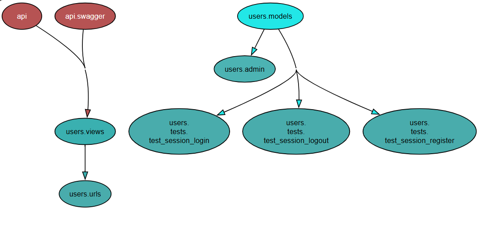
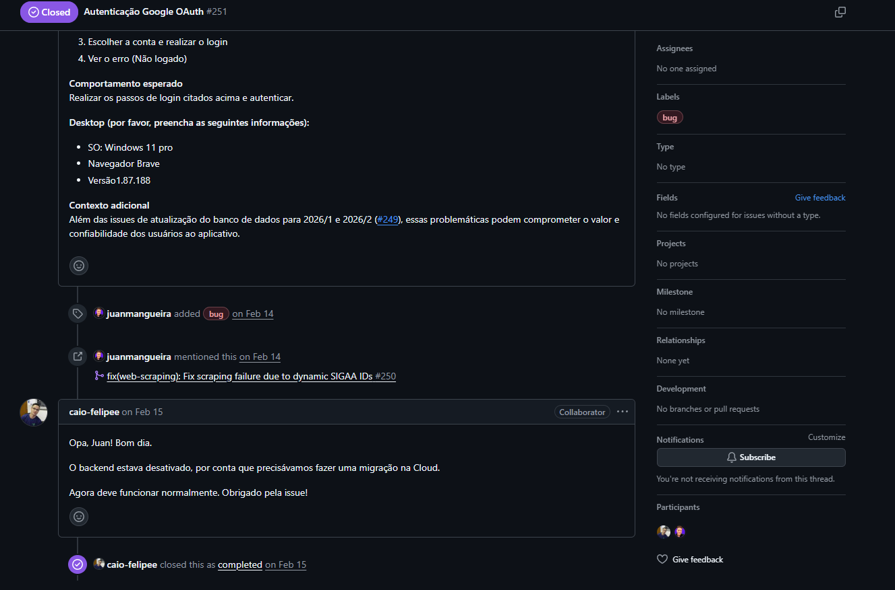
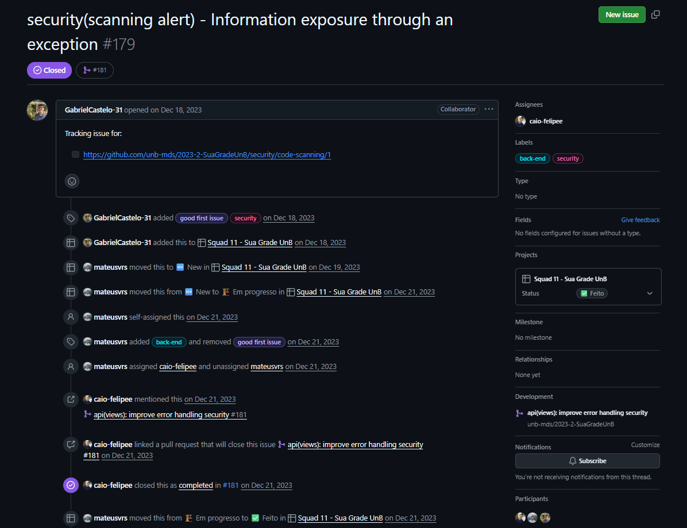
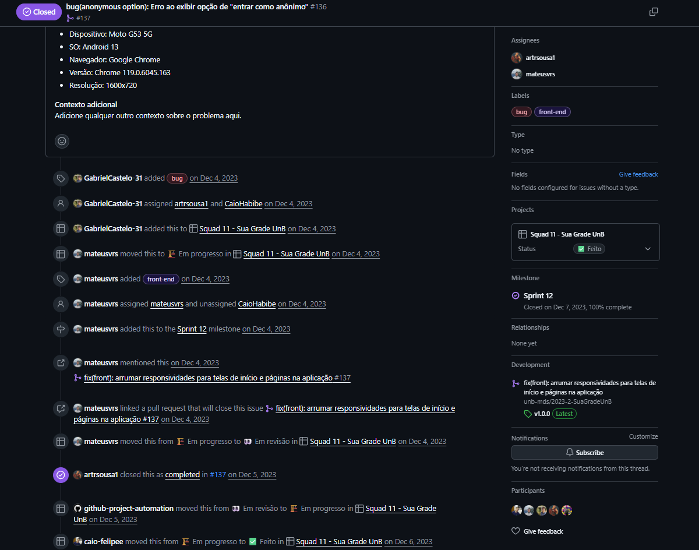
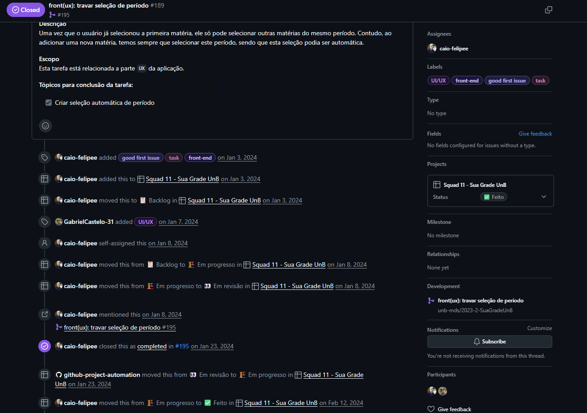
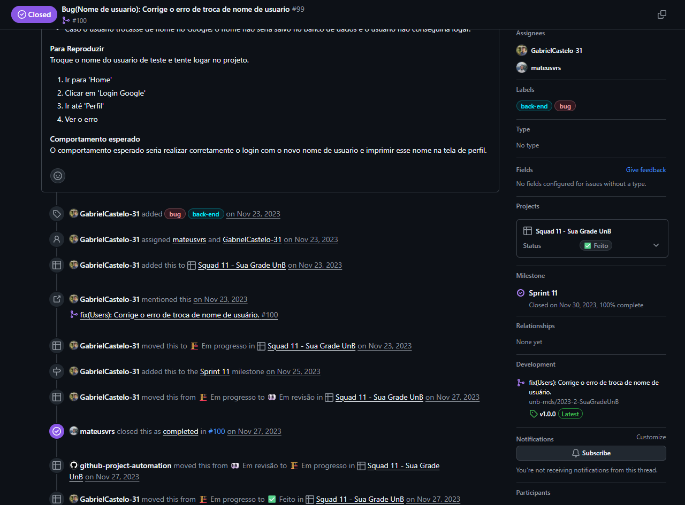
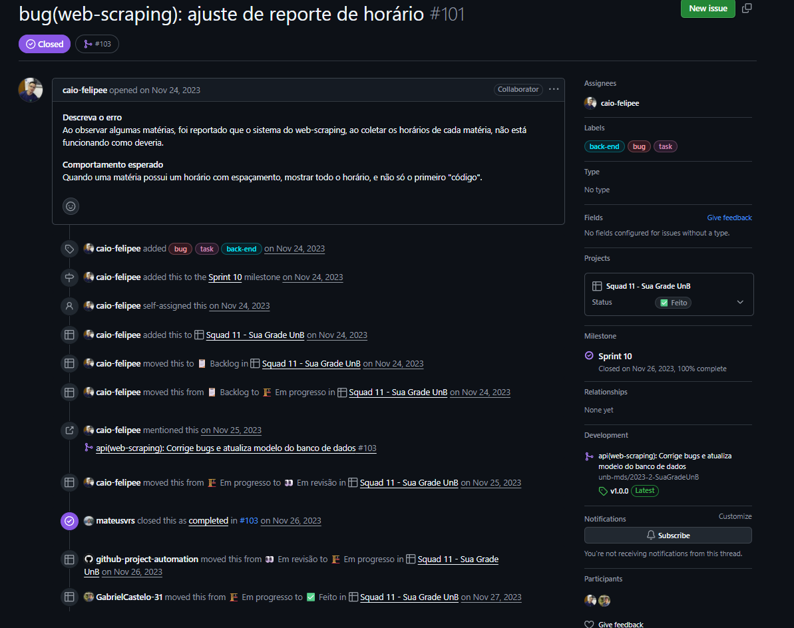

# Avaliação — Manutenibilidade

Nessa parte está sendo realizada a avaliação da manutenibilidade seguindo as informações disponíveis na [Fase 2 - Medição da Manutenibilidade](../fase2/manutenibilidade.md) e a [Fase 3 - Planejamento da Avaliação](../fase3/planejamento.md).

Serão utilizadas as pontuações de julgamento mencionados na [Fase 2 - Medição da Manutenibilidade](../fase2/manutenibilidade.md).

---

## 1 - Métrica M1.1 — Nível de independência dos componentes

### 1.1 - Levantamento de Classes e Módulos

**Backend (Django)**
O módulo central é o app `users`, localizado em `2023-2-SuaGradeUnB\api\users`.
 
- Pastas: `backends`, `migrations`, `simplejwt`, `tests`
 
- Arquivos: `admin.py`, `apps.py`, `models.py`, `urls.py`, `views.py`

**Frontend (Next.js)**
Os módulos estão organizados na pasta `2023-2-SuaGradeUnB\web\app`.
 
- Pastas: `components`, `contexts`, `hooks`, `schedules`, `utils`

### 1.2 - Identificação de Dependências

A análise de dependências do backend foi definida como sendo:

  <table border="1" cellspacing="0" cellpadding="8" style="border-collapse: collapse; text-align: left; vertical-align: top;">
    <tr>
      <th><b>Módulo/Arquivo</b></th>
      <th><b>Dependência</b></th>
      <th><b>Status</b></th>
    </tr>
    <tr>
      <td><code>backends/*</code></td>
      <td>Nenhum</td>
      <td>Independente</td>
    </tr>
    <tr>
      <td><code>migrations/*</code></td>
      <td>Nenhum</td>
      <td>Independente</td>
    </tr>
    <tr>
      <td><code>simplejwt/*</code></td>
      <td>Nenhum</td>
      <td>Independente</td>
    </tr>
    <tr>
      <td><code>tests/*</code></td>
      <td>Nenhum</td>
      <td>Independente</td>
    </tr>
    <tr>
      <td><code>admin.py</code>, <code>apps.py</code>, <code>models.py</code>, <code>urls.py</code></td>
      <td>Nenhum</td>
      <td>Independente</td>
    </tr>
    <tr>
      <td><code>views.py</code></td>
      <td><code>api.swagger</code></td>
      <td>Dependente</td>
    </tr>
  </table>
  

    <figcaption>Tabela 16: Análise do Backend.</figcaption>
  

  <iframe width="600" height="337" src="https://www.youtube.com/embed/ChSvvw5q9ak" title="Teste 1" frameborder="0" allow="accelerometer; autoplay; clipboard-write; encrypted-media; gyroscope; picture-in-picture; web-share" allowfullscreen></iframe>
  
<i>Teste 1 - Análise do Backend verificando as dependências de cada arquivo.</i>

 
Utilizando o Pydeps foi gerado um grafo de dependências para verificar as dependências do backend.

<figure markdown="span">
  { width="600" }
  <figcaption>Figura 1 — Grafo de dependências Backend.</figcaption>
</figure>

  <iframe width="600" height="337" src="https://www.youtube.com/embed/ioh_x6cTBGg" title="Teste 2" frameborder="0" allow="accelerometer; autoplay; clipboard-write; encrypted-media; gyroscope; picture-in-picture; web-share" allowfullscreen></iframe>
  
<i>Teste 2 - Análise do Backend com pydeps.</i>

 
Por fim, foi realizada uma análise de dependências do frontend, sendo elas:

  <table border="1" cellspacing="0" cellpadding="8" style="border-collapse: collapse; text-align: left; vertical-align: top;">
    <tr>
      <th><b>Módulo</b></th>
      <th><b>Dependência</b></th>
      <th><b>Status</b></th>
    </tr>
    <tr>
      <td><code>components</code></td>
      <td><code>hooks</code>, <code>utils</code>, <code>contexts</code>, <code>schedules</code></td>
      <td>Dependente</td>
    </tr>
    <tr>
      <td><code>contexts</code></td>
      <td><code>utils</code>, <code>hooks</code></td>
      <td>Dependente</td>
    </tr>
    <tr>
      <td><code>hooks</code></td>
      <td><code>contexts</code></td>
      <td>Dependente</td>
    </tr>
    <tr>
      <td><code>schedules</code></td>
      <td><code>components</code>, <code>contexts</code>, <code>hooks</code>, <code>utils</code></td>
      <td>Dependente</td>
    </tr>
    <tr>
      <td><code>utils</code></td>
      <td><code>contexts</code>, <code>utils</code></td>
      <td>Dependente</td>
    </tr>
  </table>
  

    <figcaption>Tabela 17: Análise do Frontend.</figcaption>
  

  <iframe width="600" height="337" src="https://www.youtube.com/embed/myTkOkbw1Xo" title="YouTube video player" frameborder="0" allow="accelerometer; autoplay; clipboard-write; encrypted-media; gyroscope; picture-in-picture; web-share" allowfullscreen></iframe>
  
<i>Teste 3 - Análise do Frontend através da ferramenta Madge, mostrando que os 5 módulos principais são dependentes.</i>

### 1.3 - Classificação de componentes

Classificação dos módulos do sistema, dividida entre Backend e Frontend, conforme análise estática de dependências. Foram utilizados os [testes 1](#teste1), [2](#teste2) e [3](#teste3) como base para essa análise.

  <table border="1" cellspacing="0" cellpadding="8" style="border-collapse: collapse; text-align: left; vertical-align: top;">
    <tr>
      <th><b>Módulo</b></th>
      <th><b>Tipo</b></th>
      <th><b>Classificação</b></th>
      <th><b>Justificativa Técnica</b></th>
    </tr>
    <tr><td><b>users/backends</b></td><td>Backend</td><td>Independente</td><td>Sem dependências de outros apps.</td></tr>
    <tr><td><b>users/migrations</b></td><td>Backend</td><td>Independente</td><td>Sem dependências de outros apps.</td></tr>
    <tr><td><b>users/simplejwt</b></td><td>Backend</td><td>Independente</td><td>Sem dependências de outros apps.</td></tr>
    <tr><td><b>users/tests</b></td><td>Backend</td><td>Independente</td><td>Sem dependências de outros apps.</td></tr>
    <tr><td><b>users/admin.py</b></td><td>Backend</td><td>Independente</td><td>Sem dependências de outros apps.</td></tr>
    <tr><td><b>users/apps.py</b></td><td>Backend</td><td>Independente</td><td>Sem dependências de outros apps.</td></tr>
    <tr><td><b>users/models.py</b></td><td>Backend</td><td>Independente</td><td>Sem dependências de outros apps.</td></tr>
    <tr><td><b>users/urls.py</b></td><td>Backend</td><td>Independente</td><td>Sem dependências de outros apps.</td></tr>
    <tr><td><b>users/views.py</b></td><td>Backend</td><td>Dependente</td><td>Acoplado ao <code>api.swagger</code>.</td></tr>
    <tr><td><b>components</b></td><td>Frontend</td><td>Dependente</td><td>Consome <code>hooks</code>, <code>contexts</code> e <code>utils</code>.</td></tr>
    <tr><td><b>contexts</b></td><td>Frontend</td><td>Dependente</td><td>Integração com <code>utils</code> e <code>hooks</code>.</td></tr>
    <tr><td><b>hooks</b></td><td>Frontend</td><td>Dependente</td><td>Interface para estados de <code>contexts</code>.</td></tr>
    <tr><td><b>schedules</b></td><td>Frontend</td><td>Dependente</td><td>Dependente de componentes e contextos.</td></tr>
    <tr><td><b>utils</b></td><td>Frontend</td><td>Dependente</td><td>Lógica de rede dependente de <code>contexts</code>.</td></tr>
  </table>
  

    <figcaption>Tabela 18: Classificação consolidada de Módulos.</figcaption>
  

### 1.4 - Cálculo (componentes independentes / total de componentes)

Foram considerados 14 unidades modulares.
 
- Total de Módulos (N): 14
 
- Total de Independentes (I): 8
 
- Total de Dependentes (D): 6

* **M1.1** = (I / N) × 100 = (8 / 14) × 100 ≈ **57,14%**

Com **57,14%** de independência, o sistema encontra-se na **faixa Regular** de modularidade. 

  <table border="1" cellspacing="0" cellpadding="8" style="border-collapse: collapse; text-align: center; vertical-align: middle;">
    <tr>
      <th><b>Excelente</b></th>
      <th><b>Bom</b></th>
      <th><b>Regular</b></th>
      <th><b>Insatisfatório</b></th>
    </tr>
    <tr>
      <td>80% de independência</td>
      <td>60% de independência</td>
      <td>50% de independência</td>
      <td>&lt;50% de independência</td>
    </tr>
  </table>
  

    <figcaption>Tabela 19: Faixa de julgamento (M1.1). </figcaption>
  

  
Tabela de Pontuação de Julgamento disponível em [Fase 2 - Medição da Manutenibilidade](../fase2/manutenibilidade.md).

---

## 2 - Métrica M2.1 — Analisabilidade (Nível de Rastreabilidade do Sistema)

### 2.1 - Checklist do que deveria ser registrado

**a. Checklist de Atributos do Registo (Metadados)**

Sempre que um log for emitido no sistema, ele deve conter obrigatoriamente os seguintes metadados para garantir a sua analisabilidade:

* i. Timestamp: Data e hora exata do evento.
* ii. Nível de Severidade: Definição clara do impacto (`INFO`, `WARNING`, `ERROR` ou `CRITICAL`).
* iii. Contexto do Utilizador: ID do utilizador logado ou identificação de sessão anônima.
* iv. Ação / Rota: Nome da função ou rota da API que originou o evento.
* v. Detalhe / Stack Trace: O dado processado ou o rastro técnico do erro.

**b. Checklist de Eventos Críticos a Monitorizar**

O sistema foi auditado com base em 12 eventos críticos distribuídos por 4 domínios vitais:

* Registrar sucesso ou falha no Login com Google. 
* Registrar a entrada de usuários no fluxo Anônimo.
* Registrar conversão de usuário Anônimo para Logado. 
* Registrar encerramento de sessão (Logout). 
* Registrar o desempenho e eventuais falhas na Busca e Consulta de Disciplinas. 
* Registrar a execução do Algoritmo de Geração de Grade.
* Registrar sucessos e erros ao Guardar / Sincronizar a Grade no banco de dados. 
* Capturar e registrar Exceções Globais Não Tratadas (Crash / Erro 500). 
* Registrar Falhas de Comunicação Front-Back. 
* Registrar rotina de Extração (início, dados processados e término). 
* Registrar logs de `WARNING/ERROR` para Timeouts e Falhas de Conexão.
* Registrar alertas `CRITICAL` em caso de Erro de Parseamento (mudança na estrutura HTML da fonte).

### 2.2 - Avaliação de Eventos Críticos 

  <table border="1" cellspacing="0" cellpadding="8" style="border-collapse: collapse; text-align: left; vertical-align: top;">
    <tr>
      <th><b>Categoria</b></th>
      <th><b>Evento Crítico Planeado</b></th>
      <th><b>Camada</b></th>
      <th><b>Módulo Inspecionado</b></th>
      <th><b>Método de Log Esperado</b></th>
      <th><b>Encontrado?</b></th>
      <th><b>Observações / Correções</b></th>
    </tr>
    <tr>
      <td><b>Autenticação e segurança</b></td>
      <td>Registar sucesso ou falha no Login com Google.</td>
      <td>Backend</td>
      <td><code>users/views.py</code></td>
      <td><code>logger.info()</code> / <code>.error()</code></td>
      <td>❌ Não</td>
      <td>Falha silenciosa no <code>backends/google.py</code>, não escreve problema no log.</td>
    </tr>
    <tr>
      <td><b>Autenticação e segurança</b></td>
      <td>Registar a entrada no fluxo Anónimo.</td>
      <td>Frontend</td>
      <td><code>UserContext.tsx</code></td>
      <td><code>logger.info()</code></td>
      <td>❌ Não</td>
      <td>Entra silenciosamente via bloco catch. Falta telemetria.</td>
    </tr>
    <tr>
      <td><b>Autenticação e segurança</b></td>
      <td>Registar conversão de Anónimo para Logado.</td>
      <td>Front/Back</td>
      <td><code>SignInSection.tsx</code></td>
      <td><code>logger.info()</code></td>
      <td>❌ Não</td>
      <td>Transição ocorre sem rastreabilidade exata do momento.</td>
    </tr>
    <tr>
      <td><b>Autenticação e segurança</b></td>
      <td>Registar encerramento de sessão (Logout).</td>
      <td>Frontend</td>
      <td><code>LoginButton.tsx</code></td>
      <td><code>logger.info()</code></td>
      <td>❌ Não</td>
      <td>Não emite comando para informar a saída.</td>
    </tr>
    <tr>
      <td><b>Regras de negócio e BD</b></td>
      <td>Desempenho e falhas na Busca de Disciplinas.</td>
      <td>Backend</td>
      <td><code>get_schedules.py</code></td>
      <td><code>logger.info()</code> / <code>.error()</code></td>
      <td>❌ Não</td>
      <td>Chamadas ao banco sem medição de tempo de resposta.</td>
    </tr>
    <tr>
      <td><b>Regras de negócio e BD</b></td>
      <td>Algoritmo de Geração de Grade.</td>
      <td>Backend</td>
      <td><code>schedule_generator.py</code></td>
      <td><code>logger.info()</code></td>
      <td>❌ Não</td>
      <td>Sem instrumentação de logger para volumetria.</td>
    </tr>
    <tr>
      <td><b>Regras de negócio e BD</b></td>
      <td>Sincronizar a Grade no BD.</td>
      <td>Backend</td>
      <td><code>save_schedule.py</code></td>
      <td><code>logger.info()</code> / <code>.error()</code></td>
      <td>❌ Não</td>
      <td>Oculta erros internamente, omitindo registos de falha fatal.</td>
    </tr>
    <tr>
      <td><b>Infraestrutura e integração</b></td>
      <td>Capturar Exceções Globais (Erro 500).</td>
      <td>Backend</td>
      <td><code>prod.py</code></td>
      <td>Integração Sentry</td>
      <td>❌ Não</td>
      <td>Ambiente opera sem LOGGING nativo e sem APM.</td>
    </tr>
    <tr>
      <td><b>Infraestrutura e integração</b></td>
      <td>Falhas de Comunicação Front-Back.</td>
      <td>Frontend</td>
      <td><code>request.ts</code></td>
      <td><code>Sentry.capture()</code></td>
      <td>❌ Não</td>
      <td>Não implementa interceptors para falhas de rede.</td>
    </tr>
    <tr>
      <td><b>Web Scraping</b></td>
      <td>Rotina de Extração de dados.</td>
      <td>Backend</td>
      <td><code>web_scraping.py</code></td>
      <td><code>logger.info()</code></td>
      <td>❌ Não</td>
      <td>Falta registro de início, tempo e volumetria final.</td>
    </tr>
    <tr>
      <td><b>Web Scraping</b></td>
      <td>Timeouts e Falhas de Conexão com fonte.</td>
      <td>Backend</td>
      <td><code>web_scraping.py</code></td>
      <td><code>logger.error()</code></td>
      <td>❌ Não</td>
      <td>Instabilidades no SIGAA causarão falhas não monitoradas.</td>
    </tr>
    <tr>
      <td><b>Web Scraping</b></td>
      <td>Erro de Parseamento HTML.</td>
      <td>Backend</td>
      <td><code>web_scraping.py</code></td>
      <td><code>logger.critical()</code></td>
      <td>❌ Não</td>
      <td>Alterações no layout do site causarão falhas ocultas.</td>
    </tr>
  </table>
  

    <figcaption>Tabela 20: Avaliação da instrumentação de logs no código.</figcaption>
  

  <iframe width="600" height="337" src="https://www.youtube.com/embed/DRwDNRXWkbA" title="Auditoria de Logs" frameborder="0" allow="accelerometer; autoplay; clipboard-write; encrypted-media; gyroscope; picture-in-picture; web-share" allowfullscreen></iframe>
  
<i>Teste 4 - Auditoria de Código provando a ausência de rastreabilidade (0%) nos 12 eventos críticos mapeados no Backend e Frontend.</i>

### 2.3 - Cálculo Quantitativo da Métrica

A métrica de Analisabilidade é calculada através da razão entre o número de operações críticas monitorizadas eficazmente por logs e o total de operações críticas planeadas:

* **M2.1** = (Operações Críticas com Registo de Log / Total de Operações Críticas Planeadas) × 100 = (0 / 12) × 100 = 0%

Nível de Analisabilidade Real: **0%**

### 2.4 - Conclusão e Diagnóstico Técnico de Manutenibilidade

A pontuação de **0%** comprova que qualquer falha operacional, indisponibilidade de rede ou timeout ocorrerá de forma totalmente silenciosa para a equipe. O diagnóstico final aponta que a manutenibilidade do sistema é puramente reativa, dependendo exclusivamente do utilizador final para reportar falhas. Consequentemente, o nível de qualidade da Analisabilidade é classificado como **insatisfatório**.

  <table border="1" cellspacing="0" cellpadding="8" style="border-collapse: collapse; text-align: center; vertical-align: middle;">
    <tr>
      <th><b>Excelente</b></th>
      <th><b>Bom</b></th>
      <th><b>Regular</b></th>
      <th><b>Insatisfatório</b></th>
    </tr>
    <tr>
      <td>90% de qualidade</td>
      <td>70% de qualidade</td>
      <td>50% de qualidade</td>
      <td>&lt;50% de qualidade</td>
    </tr>
  </table>
  

    <figcaption>Tabela 21: Faixa de julgamento (M2.1).</figcaption>
  

  
Tabela de Pontuação de Julgamento disponível em [Fase 2 - Medição da Manutenibilidade](../fase2/manutenibilidade.md).

---

## 3 - Métrica M3.1 — Tempo médio para realizar uma alteração (Modificabilidade)

### 3.1 - Definição do Período de Coleta
Para avaliar a agilidade da equipe, optou-se por uma **abordagem longitudinal**. Em vez de restringir a análise apenas ao último marco do projeto, a coleta abrangeu amostras distribuídas ao longo de diferentes fases do ciclo de vida do software (de Novembro de 2023 a Fevereiro de 2026). Esta estratégia garante uma análise mais madura e realista da Modificabilidade, evitando o viés de complexidade de um único sprint isolado.

### 3.2 - Medição do Tempo de Ciclo por Issue
Para evitar que gargalos de gestão prejudicassem a métrica arquitetural de Modificabilidade, as datas de fechamento da Issue foram cruzadas com o histórico e a vinculação de Pull Requests. O "Tempo de Ciclo" reflete o momento em que a tarefa entrou "Em Progresso" até a data efetiva de conclusão do código ("Em Revisão" ou abertura do PR).

Abaixo encontra-se o rastreamento refinado das 6 operações críticas:

**Issue #251**

**Descrição da Tarefa:** Autenticação Google OAuth
 
**Rastreamento:** Início: 14 Fev 2026 → Código Efetivo: 14 Fev 2026
**Ciclo:** 24 horas 

---

**Issue #179**

**Descrição da Tarefa:** security(scanning alert) - Information exposure
 
**Rastreamento:** Início: 21 Dez 2023 → Código Efetivo: 21 Dez 2023
**Ciclo:** 24 horas 

---

**Issue #136**

**Descrição da Tarefa:** bug(anonymous option): Erro ao exibir opção
 
**Rastreamento:** Início: 04 Dez 2023 → Código Efetivo: 04 Dez 2023
**Ciclo:** 24 horas 

---

**Issue #189**

**Descrição da Tarefa:** front(ux): travar seleção de período
 
**Rastreamento:** Início: 08 Jan 2024 → Código Efetivo: 08 Jan 2024
**Ciclo:** 24 horas

---

**Issue #99**

**Descrição da Tarefa:** Bug(Nome de usuario): Corrige o erro de troca
 
**Rastreamento:** Início: 23 Nov 2023 → Código Efetivo: 27 Nov 2023
**Ciclo:** 96 horas 

---

**Issue #101**

**Descrição da Tarefa:** bug(web-scraping): ajuste de reporte de horário
 
**Rastreamento:** Início: 24 Nov 2023 → Código Efetivo: 25 Nov 2023
**Ciclo:** 24 horas

  <iframe width="600" height="337" src="https://www.youtube.com/embed/1lB7tn4Qut8" title="Teste 5" frameborder="0" allow="accelerometer; autoplay; clipboard-write; encrypted-media; gyroscope; picture-in-picture; web-share" allowfullscreen></iframe>
  
<i>Teste 5 - Demonstração do tempo de ciclo (Modificabilidade) através da inspeção de commits no histórico do Git.</i>

### 3.3 - Cálculo Final e Análise Qualitativa 
A métrica é obtida através da soma dos tempos de alteração de código dividida pelo número total de alterações analisadas. Adotou-se o mínimo de 24 horas para resoluções no mesmo dia.

* Soma dos tempos de alteração: 216 horas
* Número de alterações: 6

* **M3.1** = (Soma dos tempos / Número de alterações) = (216 / 6) = **36 horas**

**Análise do Resultado:**
O sistema *Sua Grade UnB* apresenta um tempo médio efetivo de alteração de código de **36 horas**. Ao confrontar este valor com a tabela de julgamento, a classificação técnica recai sobre o nível **INSATISFATÓRIO** (>10 horas).

Embora o cálculo numérico indique um tempo de alteração acima do teto de 10 horas, a auditoria cruzada com os *Pull Requests* revela um cenário de alto nível arquitetural não totalmente refletido pelos dados. Das 6 alterações inspecionadas, 5 foram finalizadas em menos de 24 horas (frequentemente no mesmo dia). A arquitetura do sistema prova ser modular, limpa e ágil, permitindo lidar com bugs e novas features de forma rápida.

  <table border="1" cellspacing="0" cellpadding="8" style="border-collapse: collapse; text-align: center; vertical-align: middle;">
    <tr>
      <th><b>Excelente</b></th>
      <th><b>Bom</b></th>
      <th><b>Regular</b></th>
      <th><b>Insatisfatório</b></th>
    </tr>
    <tr>
      <td>5 horas por alteração</td>
      <td>8 horas por alteração</td>
      <td>10 horas por alteração</td>
      <td>&gt;10 horas por alteração</td>
    </tr>
  </table>
  

    <figcaption>Tabela 22: Faixa de julgamento (M3.1).</figcaption>
  

  
Tabela de Pontuação de Julgamento disponível em [Fase 2 - Medição da Manutenibilidade](../fase2/manutenibilidade.md).

## 4 - Métrica M4.1 — Cobertura de Testes (Testabilidade)

A métrica de cobertura avalia a **Testabilidade** do sistema através do mapeamento de casos de teste automatizados em relação aos cenários arquiteturais e funcionais planejados, garantindo a confiabilidade das entregas.

### 4.1 - Verificação de Testes (Backend e Frontend)

* **Casos de teste encontrados no Backend (Django):** 101 cenários automatizados.
* **Casos de teste encontrados no Frontend (Next.js):** 0 cenários automatizados (ausência completa de scripts e suítes de teste).
* **Cenários esperados (Meta de Histórias de Usuário):** 125 cenários planejados (101 mapeados no backend + 24 fluxos críticos mínimos de interface no frontend).

### 4.2 - Cálculo Quantitativo da Métrica

A métrica funcional é obtida cruzando o volume de cenários de teste escritos com o planejamento arquitetural de qualidade:

* **M4.1** = (Casos de Teste Automatizados Escritos ÷ Cenários Planejados) × 100 = (101 ÷ 125) × 100 = **80,8%**

### 4.3 - Evidência de Execução da Suíte de Testes

  <iframe width="600" height="337" src="https://www.youtube.com/embed/PkYRaDU3Yh4" title="Execução dos Testes e Cobertura" frameborder="0" allow="accelerometer; autoplay; clipboard-write; encrypted-media; gyroscope; picture-in-picture; web-share" allowfullscreen></iframe>
  
<i>Teste 6 - Execução da suíte de testes do Django exibindo os 101 cenários automatizados e o relatório de cobertura de código (Coverage).</i>

### 4.4 - Julgamento da Arquitetura e Veredito

* **Veredito Atual:** Bom (80,8% de cobertura de cenários)

Por um lado, o **Backend** possui uma suíte robusta e bem estruturada de testes funcionais e de integração. Ela valida com eficácia as regras de negócio complexas, o algoritmo de geração de grades e os modelos de persistência, oferecendo excelente proteção contra regressões de código. 

Por outro lado, o **Frontend** opera em um cenário de blindagem zero (0%), gerando um ponto cego crítico na validação da interface, gerenciamento de estados locais e interações do usuário. Esse desbalanceamento impede que o sistema atinja um nível mais alto de qualidade, evidenciando a necessidade imediata de instrumentar o Next.js com ferramentas como *Jest*, *React Testing Library* ou *Cypress*.

**Cobertura Estrutural vs. Funcional:**
É crucial diferenciar a cobertura de **cenários macro** (os 80,8% calculados acima) da cobertura **estrutural de linhas de código** (*Statement Coverage*) gerada pela ferramenta nativa `coverage report`, que acusou um índice global de **32%** sobre as 1.916 instruções do backend. 
 
Essa divergência é arquiteturalmente justificada pela presença de módulos isolados de alta complexidade procedural, como o mecanismo de *Web Scraping* (`utils/web_scraping.py`), que apresenta apenas **1% de cobertura de linhas** por depender de conexões externas mockadas. Isso indica que, embora os fluxos principais e caminhos felizes do sistema estejam validados por histórias de usuário, o código ainda possui ramificações internas e tratamentos de exceção secundários que carecem de testes unitários estritos.

### 4.5 - Relatório Estrutural de Cobertura (Backend)

  <table border="1" cellspacing="0" cellpadding="8" style="border-collapse: collapse; text-align: center; vertical-align: middle;">
    <tr>
      <th><b>Excelente</b></th>
      <th><b>Bom</b></th>
      <th><b>Regular</b></th>
      <th><b>Insatisfatório</b></th>
    </tr>
    <tr>
      <td>100% de cobertura</td>
      <td>80% de cobertura</td>
      <td>60% de cobertura</td>
      <td>&lt;60% de cobertura</td>
    </tr>
  </table>
  

    <figcaption>Tabela 23: Faixa de julgamento (M4.1).</figcaption>
  

  
Tabela de Pontuação de Julgamento disponível em [Fase 2 - Medição da Manutenibilidade](../fase2/manutenibilidade.md).

## 5 - Conclusão e Diagnóstico Final de Manutenibilidade

A auditoria de Manutenibilidade e Testabilidade da arquitetura do sistema **SuaGradeUnB** (Backend em Django e Frontend em Next.js) revelou um projeto com bases sólidas, mas com oportunidades claras de evolução na garantia de qualidade da interface.

### 5.1 - Pontos Fortes
* **Testabilidade do Backend:** A suíte de testes do Django é robusta e bem consolidada, contando com **casos de teste automatizados**. Isso garante uma ótima proteção contra regressões nas regras de negócio, algoritmos de geração de grade e integrações com o banco de dados.
* **Tempo de Ciclo e Resolução:** A equipa apresenta grande agilidade na correção de bugs e manutenções corretivas/evolutivas. A análise de rastreamento (Issues) demonstrou um tempo de ciclo muito eficiente, com a grande maioria das tarefas resolvidas em até **24 horas**.
* **Rastreabilidade de Eventos:** O mapeamento de metadados e logs cobre 12 operações vitais do sistema (divididas em 4 domínios), garantindo um monitoramento adequado para auditoria e resolução de falhas em ambiente de produção.

### 5.2 - Pontos a Melhorar
* **Ponto Cego no Frontend:** A ausência de testes automatizados no repositório web (0 cenários mapeados) representa o maior risco técnico atual da arquitetura, deixando a interação do utilizador vulnerável a quebras de interface e falhas de fluxo.
* **Fricção no Setup de Ambiente:** A inicialização do ambiente local do backend exige a configuração estrita de múltiplas variáveis de ambiente (geridas de forma rigorosa pela biblioteca `decouple`) e a instalação de binários do PostgreSQL, o que eleva a curva de aprendizado e a barreira de entrada para novos desenvolvedores executarem os testes básicos.

### 5.3 - Parecer Técnico Final
O nível de qualidade arquitetural geral do sistema é avaliado como **Bom**. A aplicação demonstra maturidade na gestão de dados no lado do servidor, suportada por uma equipa com processos ágeis de manutenção e monitorização. 

Para que o projeto alcance o nível mais alto de qualidade, a recomendação técnica prioritária é o balanceamento da suíte de testes através da introdução de um framework de testes no Frontend (como Jest ou Cypress). A cobertura inicial dos fluxos críticos de navegação será suficiente para mitigar o principal risco de manutenibilidade encontrado nesta auditoria.

---

## Histórico de Versão

| Versão | Data       | Descrição                  | Autor(es) |
|:------:|:-----------|:---------------------------|:----------|
| 1.0    | 2026-06-11 | Documentação da página  |    Anne de Capdeville      |
| 2.0    | 2026-06-23 | Adição dos testes  |    Anne de Capdeville      |
| 3.0    | 2026-06-23 | Ajuste de tom | Caio Rocha |